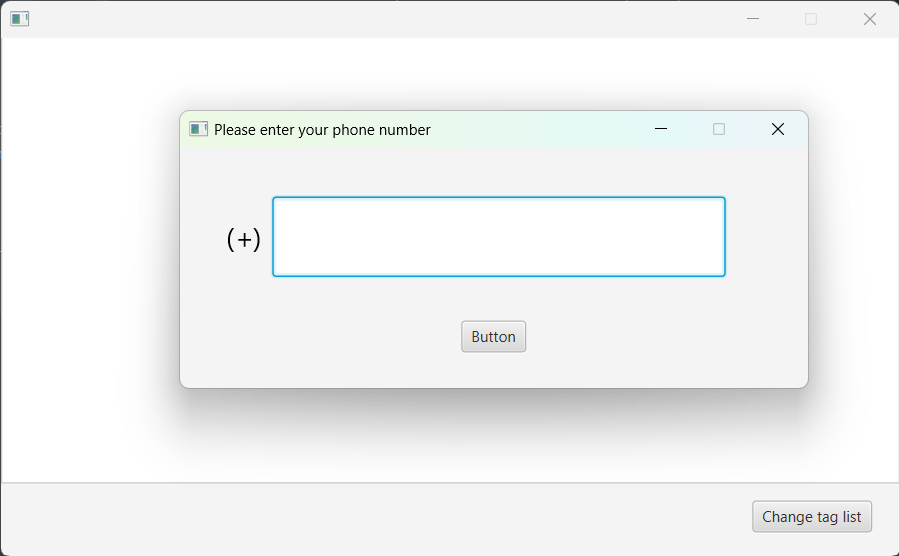
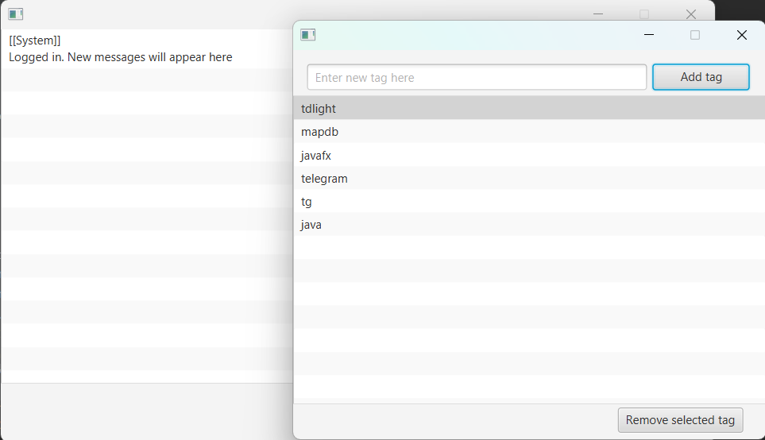

# td-message-filter

Unofficial [Telegram](https://telegram.org) GUI client 
with keyword filtering of messages from all user's chats.

## Requirements

* **Java** [JDK 17+]
* **Maven** [3.0+]

## Technologies

* **JavaFX**\
GUI platform
* [TDLight](https://github.com/tdlight-team/tdlight-java/)\
Library for building Telegram clients
* [MapDB](https://mapdb.org/)\
Embedded database, used for tag list storage
